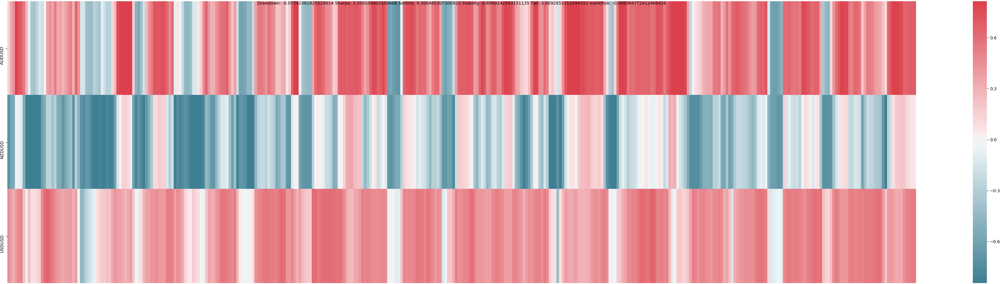
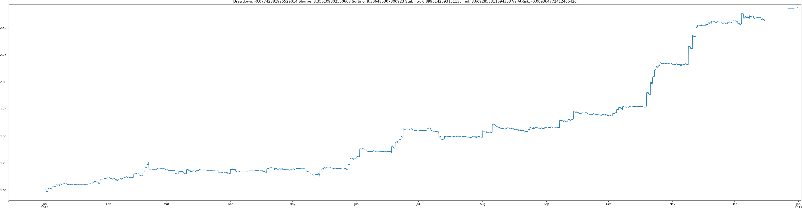
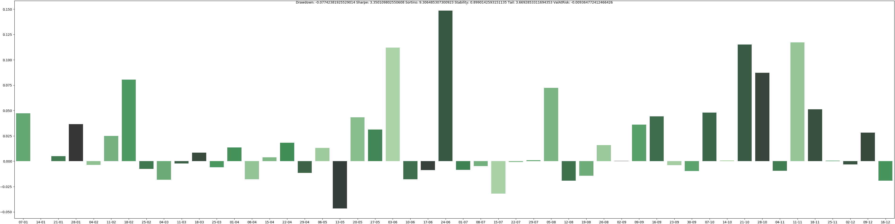
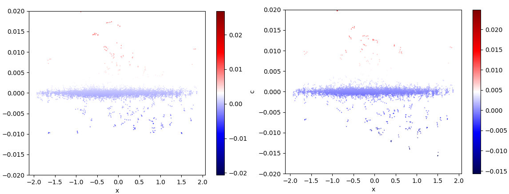

# FX Reinforcement Learning Playground

This repository contains an open challenge for a Portfolio Balancing AI in Forex.

The state of the FX market is represented via 512 features in X_train and X_test.

These 512 features summarizes the price-actions of 10+1 assets in past 10 days.

Hourly log returns of assets during train & test periods are in y_train and y_test.

Why use my features as environment summary? because they're performing well!

# Participation into the Forex RL Challenge
**example.py** contains an implementation, which balances a long-short FX portfolio.

Up to 2x leverage is allowed. Your objective is to outperform following risk metrics.

Please send me your saved model so that I can test it on a blind set for the contest.

I will list results from challengers here by sorting them using the industry-standard

risk measures including (but not limited to) the Calmar, Sortino, Omega ratio(s), etc.

# Test results of example_cpu.py available here:
Max. Drawdown: 7.74% 
Sortino Ratio: 9.30x

Sharpe Ratio: 3.35x 
Stability: 90.31% 

Tail Ratio: 3.67x 
Value at Risk: -0.94%

# Daily Portfolio Balances

# Annual Cumulative Return

# Weekly Portfolio Log Return

# How you can get rich out of this?
If you obtain successful results and you want to use your RL model for live-trading,

you can contact me for subscribing to a real-time feed of the environment summary.

Your objective results here can also attract business opportunities such as job offers.

# If you are interested in academics:
Are you an academician? Use FX RL challenge to experiment with it in your publication.

You won't need to worry about the right feature extraction, as I already did that for you.

Fixed input for challengers will allow a clear benchmarking of RL methods developed.

Below is a survey paper about reinforcement learning applications in financial markets.

https://www.statistik.rw.fau.de/files/2018/10/12-2018.pdf

# Sponsorships and Hackhathons

Please, contact me if you would like to sponsor the FX RL challenge; or organize a local

meetup, workshop or Hackathon where RL practitioners can participate to this challenge. 

# Bonus: Example Implementation
PyTorch implementation of Multi-processed training of a shared model where batches

are divided across processes. Looking for a person to contribute a TensorFlow version.

Multi-threaded implementation of Augmented Random Search method is also available!

Run the GPU version and then post-train with the CPU version (ARS) to get best results.

# Bonus: Autoencoder Interpretation

PyTorch implementation of Variational Autoencoder (VAE) provided in the repository

demonstrates that features has great ability of capturing the right direction for the

majority of the extreme movements of the AUD (left) and NZD (right) assets, which

is the key to the success of the portfolio balancing policy that has been converged.

